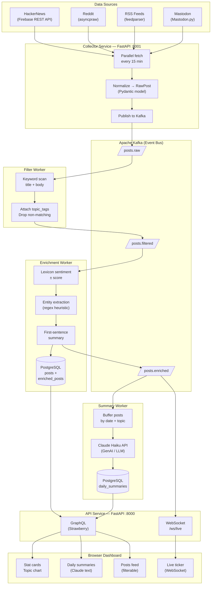

# Social Pulse Analyzer

An educational, production-inspired platform that monitors social media and news sources, streams events through Apache Kafka, enriches posts with automated analysis, and generates AI-written daily briefings via Claude. A GraphQL API and browser dashboard expose the results in real time.

---

## Table of Contents

- [Architecture Overview](#architecture-overview)
- [Data Processing Pipeline](#data-processing-pipeline)
- [Data Flow Diagram](#data-flow-diagram)
- [Technologies](#technologies)
- [Libraries](#libraries)
- [AI & Machine Learning](#ai--machine-learning)
- [Database Schema](#database-schema)
- [Demo vs Full Stack](#demo-vs-full-stack)
- [Getting Started](#getting-started)

---

## Architecture Overview

The system is split into five independent services that communicate exclusively through Kafka topics. No service calls another directly — every interaction is mediated by an event.

```
Data Sources  →  Collector  →  Kafka  →  Filter Worker
                                      →  Enrichment Worker  →  PostgreSQL
                                      →  Summary Worker     →  PostgreSQL
                                               ↓
                                         GraphQL API  →  Browser Dashboard
```

| Service | Port | Role |
|---|---|---|
| `collector` | 8001 | Pulls from external APIs, publishes raw posts |
| `filter-worker` | — | Tags posts by tracked topic keywords |
| `enrichment-worker` | — | Adds sentiment, entities, and per-post summaries |
| `summary-worker` | — | Builds daily AI briefings via Claude |
| `api` | 8000 | GraphQL query layer + WebSocket live stream |
| `kafka-ui` | 8080 | Visual Kafka topic browser |

---

## Data Processing Pipeline

### Step 1 — Collection

**Service:** `collector/main.py`

The collector is a FastAPI application with a background task that fires every 15 minutes. It calls four source adapters in parallel and normalizes each result into a `RawPost` Pydantic model with a common schema:

```
platform, external_id, author, title, body, url, raw_score, timestamp
```

Each normalized post is published to the `posts.raw` Kafka topic. The service also exposes REST endpoints (`POST /collect/{source}`, `POST /collect/all`) so collection can be triggered manually at any time.

**Sources:**
- **HackerNews** — top stories via the public Firebase REST API (no auth required)
- **Reddit** — hot posts from topic-relevant subreddits via the PRAW async API
- **RSS Feeds** — any URL list configured in `.env`, parsed with feedparser
- **Mastodon** — public timeline of any instance via the Mastodon.py client

---

### Step 2 — Filtering

**Service:** `workers/filter_worker/main.py`  
**Consumes:** `posts.raw`  
**Produces:** `posts.filtered`

The filter worker is a long-running Kafka consumer. For each incoming post it scans the combined `title + body` text for any of the configured topic keywords (e.g. `"artificial intelligence"`, `"climate change"`, `"cryptocurrency"`).

Posts that match at least one keyword are forwarded with a `topic_tags` list attached. Posts that match nothing are dropped. This keeps downstream workers focused on relevant content and reduces storage volume.

```
"Amazon workers under pressure to up their AI usage..."
                         ↓  matches "ai", "amazon"
topic_tags = ["ai", "amazon"]  →  published to posts.filtered
```

---

### Step 3 — Enrichment

**Service:** `workers/enrichment_worker/main.py` + `enricher.py`  
**Consumes:** `posts.filtered`  
**Produces:** `posts.enriched`  
**Persists:** `posts` + `enriched_posts` tables in PostgreSQL

Each filtered post is run through the enrichment pipeline which adds four fields:

| Field | Method | Description |
|---|---|---|
| `sentiment` | Lexicon-based (see below) | `positive` / `neutral` / `negative` |
| `sentiment_score` | Lexicon-based | Float from −1.0 to 1.0 |
| `category` | Keyword lookup | Topic category label |
| `entities` | Regex heuristic | Capitalized proper nouns |
| `summary` | First-sentence extraction | Short post digest |

The enriched post is then upserted into PostgreSQL (`ON CONFLICT DO NOTHING` on `platform + external_id`) and forwarded to `posts.enriched`.

The enricher is designed as a **swap point**: the body of `enricher.py:enrich()` can be replaced with real API calls (Claude, OpenAI) without touching anything else in the pipeline.

---

### Step 4 — Daily Summarization

**Service:** `workers/summary_worker/main.py`  
**Consumes:** `posts.enriched`  
**Persists:** `daily_summaries` table in PostgreSQL

The summary worker maintains an in-memory buffer of `{date → {topic → [posts]}}`. At midnight UTC it flushes each topic group:

1. Computes sentiment breakdown (% positive / neutral / negative)
2. Extracts trending words (top-N after stop-word removal)
3. Calls **Claude Haiku** to write a human-readable 2–3 sentence briefing
4. Upserts a `daily_summaries` row

The worker also listens for `SIGUSR1` so a summary can be forced at any time during development.

---

### Step 5 — API & Dashboard

**Service:** `api/main.py` + `api/schema.py`  
**Endpoint:** `http://localhost:8000/graphql`  
**Dashboard:** `http://localhost:8000`

A FastAPI application that mounts a Strawberry GraphQL router. All queries resolve against PostgreSQL. A separate background task consumes `posts.enriched` and fans out every new post to all connected WebSocket clients (`/ws/live`), enabling a real-time feed in the browser.

---

## Data Flow Diagram



---

## Technologies

### FastAPI

**Used in:** `collector/` and `api/`

FastAPI is an async Python web framework built on ASGI (Starlette + Pydantic). It was chosen here for three reasons:

1. **Native async** — all I/O (Kafka, HTTP calls to external APIs, PostgreSQL) runs on the same event loop without blocking threads.
2. **Automatic validation** — Pydantic models are used as request/response schemas; FastAPI rejects malformed input before it ever reaches business logic.
3. **Lifespan events** — the `@asynccontextmanager lifespan` hook starts background tasks (periodic collection, Kafka consumers) cleanly when the server boots and shuts them down gracefully.

The collector exposes a REST API for manual triggering. The API service mounts a GraphQL router alongside a WebSocket endpoint on the same FastAPI app.

---

### Apache Kafka

**Used in:** all workers and both FastAPI services  
**Client library:** `aiokafka`

Kafka is a distributed, persistent, ordered event log. In this project it acts as the central nervous system: every service communicates exclusively through Kafka topics rather than direct calls.

**Why Kafka and not a simple queue or direct calls?**

- **Decoupling** — the collector doesn't know whether the filter worker is running. It just appends to a topic. Services can restart, scale, or be replaced independently.
- **Replay** — Kafka retains messages. If the enrichment worker crashes, it resumes from where it left off. No posts are lost.
- **Fan-out** — multiple consumers can read the same topic independently. The API's live-stream consumer and the summary worker both read `posts.enriched` without interfering.
- **Visibility** — the Kafka UI (port 8080) shows every message in every topic, making the pipeline observable without code changes.

**Topics in this project:**

| Topic | Producer | Consumers |
|---|---|---|
| `posts.raw` | collector | filter-worker |
| `posts.filtered` | filter-worker | enrichment-worker |
| `posts.enriched` | enrichment-worker | summary-worker, api live-stream |

---

### GraphQL

**Used in:** `api/schema.py` via Strawberry  
**Library:** `strawberry-graphql`

GraphQL is a query language for APIs where the client declares exactly which fields it needs. Unlike REST (where each endpoint returns a fixed shape), GraphQL lets the dashboard request only the data it will render.

**Why GraphQL instead of REST for the API layer?**

- **Single endpoint, flexible shape** — the dashboard can ask for `topicStats`, `posts`, and `dailySummary` in one round trip, each with only the fields it needs.
- **Nested data** — the `dailySummary` query returns a `sentiment` object with sub-fields; this nests naturally in GraphQL and would require multiple REST endpoints or a custom envelope.
- **Self-documenting** — the GraphiQL IDE (at `/graphql`) is generated automatically from the schema with no extra work.

Example query that the dashboard issues on load:

```graphql
{
  topicStats {
    topic
    postCount
    positivePct
    neutralPct
    negativePct
  }
  dailySummary(topic: "ai") {
    summaryText
    trendingWords
    sentiment { positive neutral negative }
  }
}
```

---

## Libraries

### Data Collection

| Library | Version | Purpose |
|---|---|---|
| `aiohttp` | 3.9.5 | Async HTTP client used to call the HackerNews Firebase API and any custom HTTP sources. Non-blocking — hundreds of item fetches run concurrently on one event loop. |
| `asyncpraw` | 7.7.1 | Async wrapper around the Reddit API (PRAW). Authenticates with Reddit's OAuth2 client-credentials flow and streams hot posts from configured subreddits. |
| `feedparser` | 6.0.11 | Parses RSS and Atom feeds from any URL. Handles dozens of feed format variations and date formats automatically. Used for news site RSS sources. |
| `Mastodon.py` | 1.8.1 | Python client for the Mastodon ActivityPub API. Reads the public timeline of any configured instance. Mastodon is the closest openly accessible Twitter-like source. |
| `httpx` | 0.27.0 | Sync/async HTTP client; included as a dependency of several libraries. |

### Streaming & Messaging

| Library | Version | Purpose |
|---|---|---|
| `aiokafka` | 0.10.0 | Async Kafka producer and consumer client. Used in every service — the collector publishes, the workers consume and produce. All operations are `await`-able and run without blocking threads. |

### API & Validation

| Library | Version | Purpose |
|---|---|---|
| `fastapi` | 0.111.0 | Async web framework for the collector REST API and the GraphQL/WebSocket API service. |
| `uvicorn` | 0.29.0 | ASGI server that runs FastAPI. Handles HTTP/1.1, HTTP/2, and WebSockets. |
| `strawberry-graphql` | 0.227.0 | Code-first GraphQL library for Python. Schema is defined in pure Python using `@strawberry.type` dataclasses; no `.graphql` schema files needed. |
| `pydantic` | 2.7.1 | Data validation and serialization. Every post moving through the pipeline is a Pydantic model — invalid data raises a clear error at the boundary. |
| `pydantic-settings` | 2.2.1 | Reads configuration from environment variables or `.env` files into typed Pydantic models. |

### Storage

| Library | Version | Purpose |
|---|---|---|
| `asyncpg` | 0.29.0 | High-performance async PostgreSQL driver. Directly executes parameterized SQL — used in the enrichment worker (upserts) and the API (queries). |
| `sqlalchemy` | 2.0.30 | ORM / query builder. Included as a dependency; the project uses raw SQL via asyncpg for simplicity but SQLAlchemy is available for model-based queries. |
| `redis` | 5.0.4 | Async Redis client. Wired into the API service for future response caching. |

### AI

| Library | Version | Purpose |
|---|---|---|
| `anthropic` | 0.101.0 | Official Python SDK for the Claude API (Anthropic). Used in the summary worker to call Claude Haiku and generate daily briefings. See [AI & Machine Learning](#ai--machine-learning). |

### Frontend (CDN, no install)

| Library | Source | Purpose |
|---|---|---|
| Chart.js 4 | CDN | Renders the stacked bar chart of topic sentiment breakdown. |
| Tailwind CSS | CDN | Utility-first CSS framework for the dashboard layout and dark theme. |

---

## AI & Machine Learning

### Where AI is used

This project uses AI at **one specific step**: the daily summarization stage. All other enrichment (sentiment, entities, per-post summaries) uses deterministic, rule-based code — by design, so you can see clearly where AI adds value and where it doesn't.

---

### Rule-Based Enrichment (not ML)

**File:** `workers/enrichment_worker/enricher.py`

The per-post enrichment uses no machine learning model. It works through:

- **Sentiment:** Lexicon matching against two hard-coded word sets (`_POSITIVE`, `_NEGATIVE`). Score = `(positive_hits - negative_hits) / total_hits`. This is the simplest possible approach — fast, free, deterministic, and requires no model loading or API calls.
- **Entities:** Regex for capitalized words (`[A-Z][a-z]{2,}`). A stand-in for Named Entity Recognition (NER). In a production system this would be replaced with a model like spaCy's `en_core_web_sm`.
- **Summary:** First sentence extraction. Splits on sentence-ending punctuation and returns the first 200 characters.

This is intentional: the enricher is a clearly marked swap point. The docstring says `"Swap the body of enrich() with real API calls when ready."` Swapping it with a Claude or OpenAI call per post would produce richer results at a cost of ~$0.70–$3/day depending on model.

---

### Generative AI — Large Language Model (LLM)

**Technology:** Generative AI / LLM  
**Model:** `claude-haiku-4-5-20251001` (Anthropic)  
**File:** `workers/summary_worker/main.py`  
**SDK:** `anthropic` Python library

#### What is a Large Language Model?

A Large Language Model (LLM) is a deep learning model — typically a Transformer architecture — trained on vast amounts of text to predict the next token in a sequence. Modern LLMs like Claude, GPT-4, or Gemini can follow instructions, summarize documents, answer questions, write code, and generate coherent prose. They are the foundation of the **Generative AI** (GenAI) category: AI that generates new content rather than classifying or predicting a fixed label.

LLMs are not trained or fine-tuned in this project. They are called as a **hosted API service** — the model weights live on Anthropic's infrastructure and are accessed via HTTP.

#### How it is used here

Once per day per topic (or on flush), the summary worker sends a prompt to Claude containing:

```
System: "You are a social media analyst writing concise daily briefings.
         Be factual, neutral, and highlight the most significant stories.
         Write 2–3 sentences maximum."

User:   "Write a daily briefing for the topic 'ai' based on these 12 posts
         from today (15% positive, 80% neutral, 5% negative):

         - RTX 5090 and M4 MacBook Air: Can It Game? (score: 671, sentiment: neutral)
         - Amazon workers pressured to increase AI usage are fabricating tasks (score: 208, ...)
         - Show HN: Watch a neural net learn to play Snake (score: 16, ...)"
```

Claude returns a prose paragraph like:

> *Top story: RTX 5090 and M4 MacBook Air gaming performance testing dominated engagement (671 points), while OpenAI's integration of ChatGPT with bank accounts via Plaid raises new questions about AI financial access. A concerning report emerged that Amazon workers pressured to increase AI usage are fabricating tasks to meet quotas, highlighting adoption challenges in enterprise environments.*

#### Why Claude Haiku specifically?

| Consideration | Choice |
|---|---|
| **Task complexity** | Summarizing 10–20 short titles requires moderate reasoning — Haiku handles this well. |
| **Cost** | Haiku is the fastest and cheapest Claude model: ~$0.80/MTok input, $4/MTok output. With 9 topics/day this costs under $0.01/day. |
| **Latency** | Summaries are generated at midnight (batch), not in real time, so speed is not critical. |
| **Quality** | The structured prompt (system role + explicit format constraint "2–3 sentences") gives consistent, well-formed output across all topics. |

#### Configuration / Parameters

```python
client.messages.create(
    model   = "claude-haiku-4-5-20251001",  # model version
    max_tokens = 300,                        # hard cap on output length
    system  = "...",                         # role + style instructions
    messages = [{"role": "user", "content": "..."}]
)
```

- **`max_tokens=300`** caps the output at roughly 3–4 sentences, preventing verbose responses.
- **`system` prompt** constrains the persona and format, making outputs consistent across topics and days.
- **No `temperature` set** — defaults to Anthropic's recommended value (~1.0 for Claude). For factual summarization a lower temperature (0.3–0.5) would make outputs more conservative; left at default here to allow natural prose variation.

#### AI Technologies NOT used in this project

The following AI technologies are referenced for context but are not part of this project:

- **Speech-to-text** — no audio input; all sources are text.
- **Image diffusion / image classification** — no image processing.
- **Chatbots** — the GraphQL API has no conversational interface.
- **Retrieval-Augmented Generation (RAG)** — posts are queried via SQL, not a vector store. RAG would be a natural next step: embed posts with a model like `text-embedding-3-small`, store in pgvector, and let users ask semantic questions like *"show me discussions similar to yesterday's AI regulation debate"*.
- **Agentic AI** — Claude is called once per topic per day in a single-turn, single-tool pattern. An agentic approach would let the model decide which topics to summarize, call the GraphQL API itself, and iteratively refine its output.

---

## Database Schema

```sql
posts              -- one row per collected post (deduplicated by platform + external_id)
enriched_posts     -- one-to-one extension: sentiment, entities, summary
daily_summaries    -- one row per (date, topic), contains Claude-generated text
```

---

## Demo vs Full Stack

### Why this project is deployed as a demo

This project is intentionally deployed as a **single-process demo** (`demo.py`) rather than the full multi-service Docker stack. The decision is grounded in infrastructure cost, resource consumption, and fitness for purpose — all of which are explained below as part of the educational goals of the project.

---

### What the demo does vs what the full stack adds

The demo collapses all pipeline stages into a single Python process with SQLite for persistence. The full stack separates each stage into an independent service connected by Kafka.

```
Demo (demo.py — one process)                Full stack (docker compose — 10 services)
─────────────────────────────────────────   ─────────────────────────────────────────
fetch → filter → enrich → summarize         Collector → Kafka → Filter Worker
        (all function calls)                         → Enrichment Worker → PostgreSQL
SQLite for persistence                               → Ranking Worker
APScheduler for daily job at 07:15 UTC               → Summary Worker → PostgreSQL
                                            API service reads from PostgreSQL
                                            WebSocket reads live from Kafka
```

| Capability | Demo | Full stack |
|---|---|---|
| Collect from 13 sources | ✅ | ✅ |
| Semantic filtering (TF-IDF) | ✅ | ✅ |
| Time-decay ranking | ✅ | ✅ |
| Sentiment + entity enrichment | ✅ | ✅ |
| Deduplication + cross-platform clustering | ✅ | ✅ |
| AI daily summaries (Claude Haiku) | ✅ | ✅ |
| GraphQL API + dashboard | ✅ | ✅ |
| RAG search | ✅ | ✅ |
| Entity co-occurrence graph | ✅ | ✅ |
| Historical trend charts | ✅ | ✅ |
| Spike detection | ✅ | ✅ |
| Scheduled daily collection (07:15 UTC) | ✅ APScheduler | ✅ APScheduler |
| Data persistence across restarts | ✅ SQLite | ✅ PostgreSQL |
| Real-time WebSocket live stream | ⚠️ endpoint exists, idle | ✅ fed by live Kafka stream |
| Horizontal scaling (multiple workers) | ❌ single process | ✅ via Kafka partitions |
| Service isolation (crash one, rest run) | ❌ all-or-nothing | ✅ independent processes |
| Kafka event replay on worker failure | ❌ | ✅ offset-based resume |
| Redis response caching | ❌ | ✅ |
| Kafka UI (event stream visibility) | ❌ | ✅ port 8080 |

---

### Resource consumption: demo vs full stack

The most critical difference for deployment is **RAM**. The full stack requires running Kafka + ZooKeeper — two JVM processes that together consume over 750 MB just at idle, before any application code runs.

**Demo (`demo.py`):**

| Component | RAM |
|---|---|
| Python process (FastAPI + sklearn + aiohttp) | ~350 MB |
| SQLite | ~5 MB |
| **Total** | **~355 MB** |

**Full stack (Docker Compose, 10 services):**

| Service | RAM |
|---|---|
| ZooKeeper | 256 MB |
| Kafka broker | 512 MB |
| PostgreSQL | 256 MB |
| Redis | 64 MB |
| Collector (FastAPI) | 128 MB |
| Filter worker (sklearn TF-IDF) | 256 MB |
| Enrichment worker | 128 MB |
| Ranking worker (sklearn) | 256 MB |
| Summary worker | 128 MB |
| API service (FastAPI + Strawberry) | 128 MB |
| Kafka UI | 256 MB |
| **Total** | **~2.8 GB** |

The full stack requires **8× more RAM** than the demo. This is almost entirely due to Kafka and ZooKeeper being JVM-based and reserving heap at startup regardless of message volume.

---

### Cost analysis (AWS EC2, eu-west-1 — Ireland)

This project is hosted on an existing AWS EC2 instance at `54.78.82.101` (eu-west-1). The table below shows what instance type each deployment mode requires and what it costs.

| EC2 type | RAM | vCPU | Demo fits? | Full stack fits? | On-demand price | Monthly cost |
|---|---|---|---|---|---|---|
| t3.micro | 1 GB | 2 | ✅ | ❌ | $0.0114/hr | ~$8 |
| t3.small | 2 GB | 2 | ✅ | ❌ | $0.0228/hr | ~$17 |
| **t3.medium** | **4 GB** | **2** | **✅** | **✅ (tight)** | **$0.0464/hr** | **~$34** |
| t3.large | 8 GB | 2 | ✅ | ✅ (comfortable) | $0.0928/hr | ~$68 |
| t3.xlarge | 16 GB | 4 | ✅ | ✅ (production) | $0.1856/hr | ~$136 |

**Key finding:** switching from the demo to the full stack forces a minimum instance upgrade from t3.micro/small (where the existing site runs) to t3.medium — adding **$17–26/month** in EC2 cost alone, before accounting for additional EBS storage (Kafka needs 20 GB of log space on top of the OS disk).

---

### Fitness for purpose analysis

The three capabilities the full stack provides that the demo does not — horizontal scaling, service isolation, and live Kafka streaming — are each evaluated against the actual usage pattern of this deployment:

**Horizontal scaling**
> Kafka allows multiple enrichment workers to process posts in parallel by distributing topic partitions across consumers. This matters at high throughput — thousands of posts per minute.
>
> *This deployment collects once per day and processes ~300 posts. A single process completes the full pipeline in under 60 seconds. Horizontal scaling provides zero practical benefit here.*

**Service isolation**
> In the full stack, a crashing enrichment worker does not affect the API or the collector. Each process is independent.
>
> *With one scheduled collection per day and no SLA, a process crash means the next day's data is collected 24 hours later. The demo restarts via `systemd` in under 5 seconds. Isolation is not worth the infrastructure cost at this scale.*

**Real-time WebSocket live stream**
> In the full stack, every post flowing through `posts.enriched` is immediately pushed to connected browser clients, creating a genuine live ticker.
>
> *In the demo the WebSocket endpoint exists but only receives posts during the 60-second collection window. Outside of that window it is idle. Given daily collection, a "live" ticker would update for 60 seconds per day. The educational value of the feature is demonstrated through the code; the operational value at daily cadence is negligible.*

---

### Conclusion

The demo version delivers **100% of the analytical features** (collection, filtering, enrichment, summaries, RAG, entity graph, historical charts, spike detection) at **~355 MB RAM** and **$0 additional infrastructure cost**, running on the existing server.

The full stack is provided in `docker-compose.yml`, `deploy/docker-compose.prod.yml`, and `k8s/` as a **complete educational reference** showing how each component would be deployed in a production environment with real traffic, multiple teams, and SLA requirements. The Kubernetes manifests in particular demonstrate concepts — StatefulSets, HPA, KEDA Kafka-lag scaling, Ingress TLS — that are standard in enterprise data platform engineering.

The architectural decision principle illustrated here: **match infrastructure complexity to actual scale requirements**. Kafka and container orchestration are powerful tools that solve real problems at scale. Deploying them for a single daily batch job with one user is over-engineering — and understanding *why* is as valuable as knowing *how* to use them.

---

### Quick demo (no Docker, no API keys required)

```bash
git clone https://github.com/fborbon/social-pulse
cd social-pulse
pip install fastapi "uvicorn[standard]" aiohttp feedparser pydantic \
            pydantic-settings "strawberry-graphql[fastapi]" anthropic \
            httpx python-dotenv aiofiles
cp .env.example .env          # optionally add ANTHROPIC_API_KEY
python3 demo.py
# Open http://localhost:8000
```

With no `ANTHROPIC_API_KEY` the summary worker falls back to a template string. Add the key to get real Claude summaries.

### Full stack (Docker)

```bash
cp .env.example .env          # fill in credentials
docker compose up --build
```

| URL | Service |
|---|---|
| `http://localhost:8000` | Dashboard |
| `http://localhost:8000/graphql` | GraphiQL IDE |
| `http://localhost:8001/docs` | Collector REST API |
| `http://localhost:8080` | Kafka UI |

Trigger an immediate collection:

```bash
curl -X POST http://localhost:8001/collect/all
```

### Environment variables

| Variable | Required | Description |
|---|---|---|
| `ANTHROPIC_API_KEY` | For AI summaries | Claude API key from console.anthropic.com |
| `REDDIT_CLIENT_ID` | For Reddit source | From reddit.com/prefs/apps |
| `REDDIT_CLIENT_SECRET` | For Reddit source | From reddit.com/prefs/apps |
| `MASTODON_ACCESS_TOKEN` | For Mastodon source | From your instance settings |
| `TRACK_TOPICS` | Optional | Comma-separated topic keywords (default provided) |
| `RSS_FEEDS` | Optional | Comma-separated RSS feed URLs |
