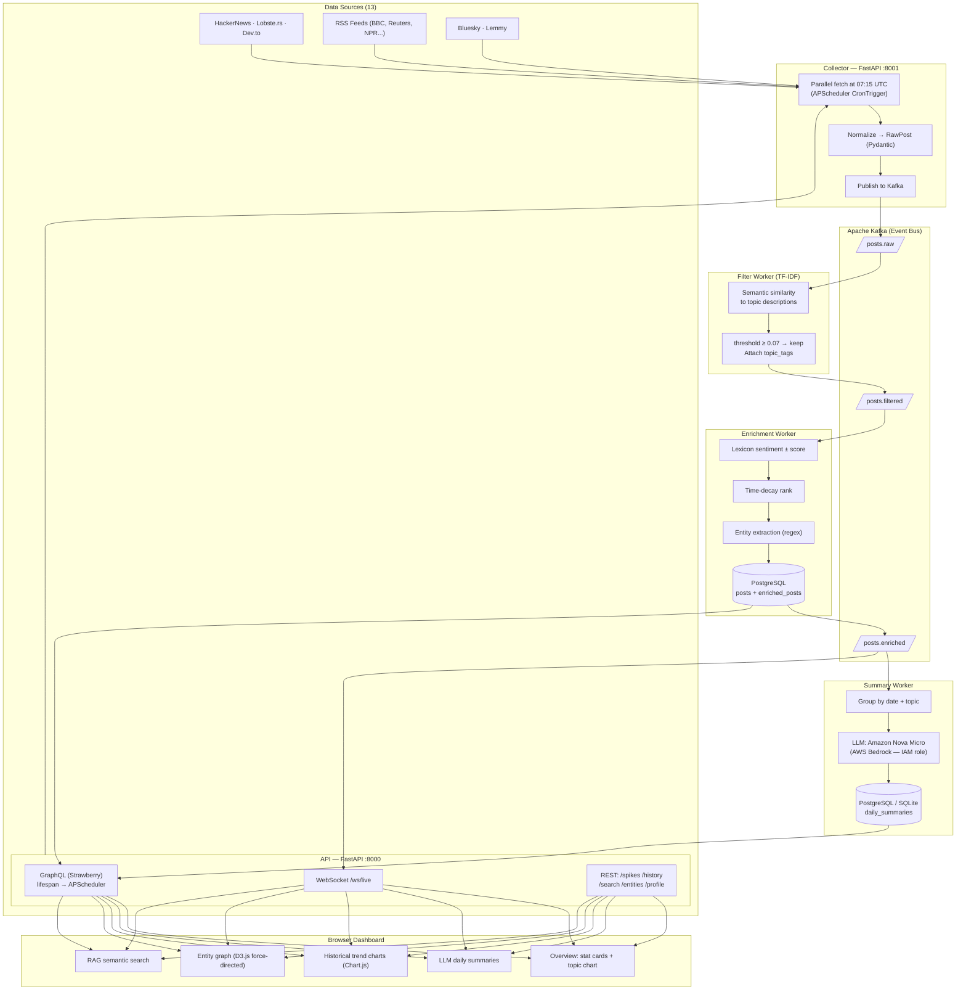

# Social Pulse Analyzer

An educational, production-inspired platform that monitors social media and news sources, streams events through Apache Kafka, enriches posts with automated analysis, and generates AI-written daily briefings via a Large Language Model (LLM). A FastAPI application serving GraphQL and WebSocket exposes the results in real time from a browser dashboard.

**Live demo:** [https://www.forwardforecasting.eu/social-pulse/](https://www.forwardforecasting.eu/social-pulse/)

---

## Table of Contents

- [Architecture Overview](#architecture-overview)
- [Data Processing Pipeline](#data-processing-pipeline)
- [Data Flow Diagram](#data-flow-diagram)
- [FastAPI — the Core Framework](#fastapi--the-core-framework)
- [Technologies](#technologies)
- [Libraries](#libraries)
- [AI & Machine Learning](#ai--machine-learning)
- [Database Schema](#database-schema)
- [Demo vs Full Stack](#demo-vs-full-stack)
- [Cost Analysis](#cost-analysis)
- [Data Coverage & Signal Quality](#data-coverage--signal-quality)
- [Getting Started](#getting-started)

---

## Architecture Overview

The system is split into five independent services that communicate exclusively through Kafka topics. No service calls another directly — every interaction is mediated by an event.

```
Data Sources  →  Collector  →  Kafka  →  Filter Worker
                                      →  Enrichment Worker  →  PostgreSQL
                                      →  Summary Worker     →  PostgreSQL
                                               ↓
                                         GraphQL API  →  Browser Dashboard
```

| Service | Port | Role |
|---|---|---|
| `collector` | 8001 | FastAPI app — pulls from external APIs, publishes raw posts |
| `filter-worker` | — | Tags posts by tracked topic keywords |
| `enrichment-worker` | — | Adds sentiment, entities, and per-post summaries |
| `summary-worker` | — | Builds daily LLM briefings via AWS Bedrock |
| `api` | 8000 | FastAPI app — GraphQL query layer + WebSocket live stream |
| `kafka-ui` | 8080 | Visual Kafka topic browser |

---

## Data Processing Pipeline

### Step 1 — Collection

**Service:** `collector/main.py` (full stack) · `demo.py` (demo)

The collector is a **FastAPI** application with a background task that fires every 15 minutes. It calls source adapters in parallel and normalizes each result into a `RawPost` Pydantic model with a common schema:

```
platform, external_id, author, title, body, url, raw_score, timestamp
```

Each normalized post is published to the `posts.raw` Kafka topic. The service also exposes REST endpoints (`POST /collect/{source}`, `POST /collect/all`) so collection can be triggered manually at any time. In the deployed demo, collection is scheduled by **APScheduler** at **07:15 UTC daily** and can be triggered on demand via `POST /collect/now`.

**Sources (13 total):**

| Source | Auth | Volume |
|---|---|---|
| HackerNews | None (public Firebase API) | 40 posts |
| Lobste.rs | None (public JSON API) | 25 posts |
| Dev.to | None (public API) | 25 posts |
| Lemmy | None (public JSON API) | 25 posts |
| Bluesky | App password | 0–25 posts |
| arXiv | None (public API) | 21 posts |
| GDELT | None (public API, 1 req/5s) | 12 posts |
| SEC EDGAR | None (public API) | 12 posts |
| Federal Register | None (public API) | 11 posts |
| RSS bundle (BBC, Reuters, NPR, Verge, Ars, TechCrunch, Nature, BLS, IGN) | None | 168 posts |
| The Guardian | API key | 0 posts (key optional) |
| NewsAPI | API key | 0 posts (key optional) |
| NY Times | API key | 0 posts (key optional) |

---

### Step 2 — Semantic Filtering

**Service:** `workers/filter_worker/main.py` (full stack) · `demo.py:semantic_filter()` (demo)  
**Consumes:** `posts.raw`  
**Produces:** `posts.filtered`

The filter uses **TF-IDF** (Term Frequency-Inverse Document Frequency) rather than keyword matching. The vectorizer is fitted on 20 rich topic descriptions. Each incoming post is vectorized and its cosine similarity to the nearest topic is computed. Posts with similarity ≥ 0.07 are kept and tagged; posts below the threshold are dropped.

```
vectorizer = TfidfVectorizer(max_features=5000)
vectorizer.fit([topic_description_1, topic_description_2, ...])

post_vec   = vectorizer.transform([post_title + " " + post_body])
topic_vecs = vectorizer.transform(topic_descriptions)
scores     = cosine_similarity(post_vec, topic_vecs)    # shape: (1, 20)
best_topic = topic_names[argmax(scores)]
if scores.max() >= 0.07: keep(post, tag=best_topic)
```

This filters ~339 raw posts down to ~229 on-topic posts per daily run.

---

### Step 3 — Enrichment

**Service:** `workers/enrichment_worker/main.py` (full stack) · `demo.py:enrich_posts()` (demo)  
**Consumes:** `posts.filtered`  
**Produces:** `posts.enriched`  
**Persists:** `posts` + `enriched_posts` tables

Each filtered post is run through the enrichment pipeline:

| Field | Method | Description |
|---|---|---|
| `sentiment` | Lexicon-based | `positive` / `neutral` / `negative` |
| `sentiment_score` | Lexicon-based | Float from −1.0 to 1.0 |
| `time_decay_score` | `raw_score / (age_hours + 2)^1.5` | Freshness-weighted rank |
| `entities` | Regex heuristic | Capitalized proper nouns |

The enricher is designed as a **swap point**: the body of `enrich()` can be replaced with real LLM calls without touching anything else in the pipeline.

---

### Step 4 — Deduplication & Clustering

**Service:** `demo.py:deduplicate()` (demo)

Cross-platform deduplication uses TF-IDF cosine similarity to cluster posts that cover the same story:

```python
vecs = TfidfVectorizer(max_features=10000).fit_transform(titles)
sim  = cosine_similarity(vecs)                    # (n_posts × n_posts)
pairs = argwhere(sim > 0.55)                      # threshold
# union-find: merge posts into clusters → keep highest-scored per cluster
```

Posts within a cluster get `cross_platform=True` if they come from ≥2 sources. The ~229 filtered posts typically reduce to ~224 unique story clusters.

---

### Step 5 — Daily Summarization

**Service:** `workers/summary_worker/main.py` (full stack) · `demo.py:build_summaries()` (demo)  
**Consumes:** `posts.enriched`  
**Persists:** `daily_summaries` table  
**AI:** AWS Bedrock → Amazon Nova Micro LLM

The summary worker groups posts by topic and, once per day, sends each group to an **LLM** (Amazon Nova Micro via AWS Bedrock):

1. Computes sentiment breakdown (% positive / neutral / negative)
2. Extracts trending words (top-N after stop-word removal)
3. Calls the LLM to write a human-readable 2–3 sentence briefing
4. Upserts a `daily_summaries` row

The LLM call uses **no API key** — authentication is handled by an IAM role attached to the EC2 instance.

---

### Step 6 — API & Dashboard

**Service:** `api/main.py` (full stack) · `demo.py` (demo)  
**Endpoint:** `/graphql`  
**Dashboard:** `/`

A **FastAPI** application that mounts a Strawberry GraphQL router and several REST endpoints. Additional endpoints:

| Endpoint | Method | Purpose |
|---|---|---|
| `/graphql` | GET/POST | GraphQL + GraphiQL IDE |
| `/ws/live` | WS | Real-time post stream |
| `/spikes` | GET | Topics with unusual post volume today |
| `/history/{topic}` | GET | 30-day historical counts + sentiment |
| `/search` | GET | RAG semantic search via LLM |
| `/entities` | GET | Co-occurrence graph for D3.js |
| `/profile` | GET | Personalized topic affinity scores |
| `/collect/now` | POST | Manual collection trigger |
| `/health` | GET | Service health check |

---

## Data Flow Diagram


```mermaid
flowchart TD
    subgraph Sources["Data Sources (13)"]
        HN["HackerNews · Lobste.rs · Dev.to"]
        RSS["RSS Feeds (BBC, Reuters, NPR...)"]
        API["arXiv · GDELT · SEC · FedReg"]
        SK["Bluesky · Lemmy"]
    end

    subgraph Collector["Collector — FastAPI :8001"]
        C1["Parallel fetch at 07:15 UTC\n(APScheduler CronTrigger)"]
        C2["Normalize → RawPost (Pydantic)"]
        C3["Publish to Kafka"]
    end

    subgraph Kafka["Apache Kafka (Event Bus)"]
        K1[/"posts.raw"/]
        K2[/"posts.filtered"/]
        K3[/"posts.enriched"/]
    end

    subgraph FW["Filter Worker (TF-IDF)"]
        F1["Semantic similarity\nto topic descriptions"]
        F2["threshold ≥ 0.07 → keep\nAttach topic_tags"]
    end

    subgraph EW["Enrichment Worker"]
        E1["Lexicon sentiment ± score"]
        E2["Time-decay rank"]
        E3["Entity extraction (regex)"]
        E4[("PostgreSQL\nposts + enriched_posts")]
    end

    subgraph SW["Summary Worker"]
        S1["Group by date + topic"]
        S2["LLM: Amazon Nova Micro\n(AWS Bedrock — IAM role)"]
        S3[("PostgreSQL / SQLite\ndaily_summaries")]
    end

    subgraph API["API — FastAPI :8000"]
        G1["GraphQL (Strawberry)\nlifespan → APScheduler"]
        G2["WebSocket /ws/live"]
        G3["REST: /spikes /history\n/search /entities /profile"]
    end

    subgraph UI["Browser Dashboard"]
        D1["Overview: stat cards + topic chart"]
        D2["LLM daily summaries"]
        D3["Historical trend charts (Chart.js)"]
        D4["Entity graph (D3.js force-directed)"]
        D5["RAG semantic search"]
    end

    HN & RSS & API & SK --> C1
    C1 --> C2 --> C3 --> K1
    K1 --> F1 --> F2 --> K2
    K2 --> E1 --> E2 --> E3 --> E4 --> K3
    K3 --> S1 --> S2 --> S3
    S3 & E4 --> G1
    K3 --> G2
    G1 & G2 & G3 --> D1 & D2 & D3 & D4 & D5
```

---

## FastAPI — the Core Framework

FastAPI is used as the **primary web framework** in every service that exposes HTTP or WebSocket interfaces. This section explains precisely where and how it is applied, making it the single most important library in the codebase.

### Where FastAPI appears

| File | Role |
|---|---|
| `demo.py` | Single-process demo — runs the full pipeline AND serves the API |
| `collector/main.py` | Standalone collection service with REST triggers |
| `api/main.py` | GraphQL + WebSocket gateway in the full stack |

### How FastAPI is used in `demo.py` (the deployed version)

The demo collapses everything into one FastAPI app. Here is the full lifecycle:

**1. Lifespan context manager — startup orchestration**

```python
@asynccontextmanager
async def lifespan(_app: FastAPI):
    await demo_db.init_db()          # create SQLite tables if missing
    await run_collection()           # load from cache or fetch fresh data
    _scheduler.add_job(              # register daily job
        run_collection,
        CronTrigger(hour=7, minute=15)
    )
    _scheduler.start()
    yield                            # app now running
    _scheduler.shutdown()
```

FastAPI's `lifespan` replaces deprecated `@app.on_event("startup")`. The async context manager guarantees that the scheduler is always stopped on shutdown — even if the app crashes — preventing zombie background tasks.

**2. GraphQL router mounted on the same app**

```python
schema = strawberry.Schema(query=Query, subscription=Subscription)
graphql_app = GraphQLRouter(schema, graphql_ide="graphiql")
app.include_router(graphql_app, prefix="/graphql")
```

Strawberry's `GraphQLRouter` is a standard FastAPI router. It plugs in alongside REST endpoints on the same ASGI app, same event loop. No separate server or port needed.

**3. REST endpoints alongside GraphQL**

FastAPI decorators handle JSON REST endpoints on the same app:

```python
@app.get("/health")
def health(): ...

@app.get("/spikes")
def spikes(): ...

@app.get("/history/{topic}")
def history(topic: str, days: int = 30): ...

@app.get("/search")
async def search(q: str = FQuery(...)): ...

@app.post("/collect/now")
async def trigger_collection():
    asyncio.create_task(run_collection())   # fire-and-forget background task
    return {"status": "collection started"}
```

Pydantic handles query parameter validation automatically — `days: int = 30` rejects non-integers before the handler runs.

**4. WebSocket live stream**

```python
@app.websocket("/ws/live")
async def ws_live(websocket: WebSocket):
    await manager.connect(websocket)
    try:
        while True:
            await asyncio.sleep(30)
            await websocket.send_json({"heartbeat": True})
    except WebSocketDisconnect:
        manager.disconnect(websocket)
```

FastAPI's native WebSocket support runs on the same Uvicorn event loop as all HTTP handlers — no separate WebSocket server.

**5. Static files and HTML response**

```python
app.mount("/static", StaticFiles(directory="frontend"), name="static")

@app.get("/", response_class=HTMLResponse)
async def index():
    html = Path("frontend/index.html").read_text()
    html = html.replace("__BASE_URL__", BASE_URL)   # inject subpath
    return HTMLResponse(html)
```

`BASE_URL` is injected server-side so that the frontend correctly prefixes all API calls when deployed at `/social-pulse/` rather than `/`.

**6. ASGI server (Uvicorn)**

```python
if __name__ == "__main__":
    uvicorn.run("demo:app", host="0.0.0.0", port=8000, reload=False)
```

Uvicorn is the ASGI server that FastAPI runs on. It handles HTTP/1.1, HTTP/2, and WebSocket protocol upgrades. In production it is managed by `systemd` with `Restart=always`.

### Why FastAPI over Flask or Django

| Feature | FastAPI | Flask | Django |
|---|---|---|---|
| Native async / await | ✅ ASGI | ⚠️ requires eventlet/gevent | ⚠️ ASGI add-on |
| Pydantic validation built-in | ✅ | ❌ | ❌ |
| WebSocket support | ✅ native | ❌ | ❌ |
| Lifespan events | ✅ | ⚠️ signals | ⚠️ AppConfig.ready() |
| Auto OpenAPI docs | ✅ `/docs` | ❌ | ❌ |
| GraphQL router plug-in | ✅ `include_router` | ⚠️ blueprint hack | ⚠️ custom view |

For an I/O-heavy pipeline (parallel HTTP fetches to 13 APIs, concurrent Kafka consumers, async SQLite) FastAPI's native async is essential. All fetches, DB writes, and WebSocket broadcasts share one event loop without thread overhead.

---

## Technologies

### Apache Kafka

**Used in:** all workers and both FastAPI services  
**Client library:** `aiokafka`

Kafka is a distributed, persistent, ordered event log. In this project it acts as the central nervous system: every service communicates exclusively through Kafka topics rather than direct calls.

**Why Kafka and not a simple queue or direct calls?**

- **Decoupling** — the collector doesn't know whether the filter worker is running. It just appends to a topic. Services can restart, scale, or be replaced independently.
- **Replay** — Kafka retains messages. If the enrichment worker crashes, it resumes from where it left off. No posts are lost.
- **Fan-out** — multiple consumers can read the same topic independently. The API's live-stream consumer and the summary worker both read `posts.enriched` without interfering.
- **Visibility** — the Kafka UI (port 8080) shows every message in every topic, making the pipeline observable without code changes.

**Topics in this project:**

| Topic | Producer | Consumers |
|---|---|---|
| `posts.raw` | collector | filter-worker |
| `posts.filtered` | filter-worker | enrichment-worker |
| `posts.enriched` | enrichment-worker | summary-worker, api live-stream |

---

### GraphQL

**Used in:** `api/schema.py` via Strawberry  
**Library:** `strawberry-graphql`

GraphQL is a query language for APIs where the client declares exactly which fields it needs. Unlike REST, GraphQL lets the dashboard request only the data it will render.

**Why GraphQL instead of REST for the API layer?**

- **Single endpoint, flexible shape** — the dashboard can ask for `topicStats`, `posts`, and `dailySummary` in one round trip, each with only the fields it needs.
- **Nested data** — the `dailySummary` query returns a `sentiment` object with sub-fields; this nests naturally in GraphQL and would require multiple REST endpoints or a custom envelope.
- **Self-documenting** — the GraphiQL IDE (at `/graphql`) is generated automatically from the schema with no extra work.

---

## Libraries

### Data Collection

| Library | Version | Purpose |
|---|---|---|
| `aiohttp` | 3.9.5 | Async HTTP client for HackerNews, GDELT, SEC EDGAR, Federal Register, Lemmy, arXiv, and RSS downloads. All requests run concurrently on one event loop. |
| `feedparser` | 6.0.11 | Parses RSS and Atom feeds. Handles dozens of format variants and date formats automatically. Used for 9 RSS sources. |
| `atproto` | latest | Async Bluesky client. Authenticates with app password and calls `searchPosts`. |
| `httpx` | 0.27.0 | Sync/async HTTP client; dependency of several libraries. |

### Streaming & Messaging

| Library | Version | Purpose |
|---|---|---|
| `aiokafka` | 0.10.0 | Async Kafka producer and consumer. All operations are `await`-able — the collector publishes, the workers consume and produce, without blocking threads. |

### Scheduling

| Library | Version | Purpose |
|---|---|---|
| `apscheduler` | 3.x | Async-native job scheduler. Runs `run_collection()` at **07:15 UTC daily** via `CronTrigger(hour=7, minute=15)`. Started inside the FastAPI `lifespan` context so it shares the app event loop. |

### API & Validation

| Library | Version | Purpose |
|---|---|---|
| `fastapi` | 0.111.0 | Async web framework — serves GraphQL, REST, WebSocket, and static files in one process. See [FastAPI section](#fastapi--the-core-framework). |
| `uvicorn` | 0.29.0 | ASGI server that runs FastAPI. Handles HTTP/1.1, HTTP/2, and WebSocket upgrades. Managed by systemd in production. |
| `strawberry-graphql` | 0.227.0 | Code-first GraphQL library. Schema is defined with `@strawberry.type` dataclasses; no `.graphql` files needed. |
| `pydantic` | 2.7.1 | Data validation. Every post moving through the pipeline is a Pydantic model — invalid data raises a clear error at the boundary. |

### Machine Learning

| Library | Version | Purpose |
|---|---|---|
| `scikit-learn` | 1.4.x | TF-IDF vectorizer for semantic topic filtering and cross-platform deduplication. `TfidfVectorizer` + `cosine_similarity` replace keyword matching with semantic similarity. |
| `numpy` | 1.26.x | Array operations for time-decay ranking, spike detection (rolling mean), and similarity matrix math. |

### Storage

| Library | Version | Purpose |
|---|---|---|
| `aiosqlite` | 0.20.0 | Async SQLite driver. Used in the demo for posts, summaries, and 30-day historical data — no PostgreSQL setup required. |
| `asyncpg` | 0.29.0 | High-performance async PostgreSQL driver for the full stack. |

### AI

| Library | Version | Purpose |
|---|---|---|
| `boto3` | 1.34.46 | AWS SDK. Used to call Amazon Nova Micro on AWS Bedrock via `bedrock-runtime.invoke_model()`. Credentials come from the EC2 IAM role — no API key in code or environment. |

### Frontend (CDN, no install)

| Library | Source | Purpose |
|---|---|---|
| Chart.js 4 | CDN | Line charts for historical trends; stacked bar for sentiment breakdown. |
| D3.js 7 | CDN | Force-directed graph for the entity co-occurrence visualization. |
| Tailwind CSS | CDN | Utility-first CSS for the dashboard layout and dark theme. |

---

## AI & Machine Learning

### Where AI is used

This project uses AI at **one specific step**: the daily summarization stage. All other enrichment (sentiment, entities, per-post summaries) uses deterministic, rule-based code — by design, so you can see clearly where AI adds value and where it doesn't.

There are also two ML models (TF-IDF vectorizers) used for filtering and deduplication — these are traditional machine learning, not LLMs, and run entirely offline with no API calls.

---

### TF-IDF Semantic Filtering (ML, not LLM)

**File:** `demo.py:semantic_filter()`

`TfidfVectorizer` from scikit-learn converts text into weighted term vectors. The vectorizer is fitted on the 20 topic descriptions (not on posts) so it "understands" the vocabulary of each topic. Posts are filtered by cosine similarity:

```python
threshold = 0.07    # empirically tuned — lower catches more, higher is stricter
```

This is unsupervised machine learning: no labeled data, no training loop, no GPU. It runs in milliseconds on CPU.

---

### TF-IDF Deduplication (ML, not LLM)

**File:** `demo.py:deduplicate()`

A second TF-IDF vectorizer (max 10,000 features) computes pairwise cosine similarity across all post titles. Pairs above 0.55 threshold are merged into clusters using a union-find algorithm. The highest-scored post from each cluster is kept as the canonical story.

---

### Rule-Based Enrichment (not ML)

**File:** `workers/enrichment_worker/enricher.py`

Per-post enrichment uses no machine learning model:

- **Sentiment:** Lexicon matching against two hard-coded word sets (`_POSITIVE`, `_NEGATIVE`). Score = `(positive_hits - negative_hits) / total_hits`. Fast, free, deterministic.
- **Entities:** Regex for capitalized words (`[A-Z][a-z]{2,}`). A stand-in for Named Entity Recognition (NER). In production this would be replaced with spaCy's `en_core_web_sm`.

---

### Generative AI — Large Language Model (LLM)

**Technology:** Generative AI / LLM  
**Model:** Amazon Nova Micro (`eu.amazon.nova-micro-v1:0`)  
**Provider:** AWS Bedrock (cross-region inference profile, eu-west-1)  
**File:** `bedrock_client.py`, called from `demo.py:_ai_summary()` and `demo_rag.py:rag_answer()`  
**SDK:** `boto3` — credentials via EC2 IAM role, no API key needed

#### What is a Large Language Model?

A Large Language Model (LLM) is a deep learning model — typically a Transformer architecture — trained on vast amounts of text to predict the next token in a sequence. Modern LLMs can follow instructions, summarize documents, answer questions, write code, and generate coherent prose. They are the foundation of the **Generative AI** (GenAI) category: AI that generates new content rather than classifying or predicting a fixed label.

LLMs are not trained or fine-tuned in this project. They are called as a **hosted API service** — the model weights live on AWS infrastructure and are accessed via HTTP through the Bedrock runtime API.

#### How it is used here

**1 — Daily topic briefings** (once per day, 20 topics)

The summary builder sends a prompt containing the top-scored post titles, their sentiments, and the aggregate sentiment breakdown:

```
System: "You are a social media analyst writing concise daily briefings.
         Be factual, neutral, and highlight the most significant stories.
         Write 2-3 sentences maximum."

User:   "Write a daily briefing for the topic 'silicon valley' based on these
         18 posts from today (39% positive, 61% neutral, 0% negative):

         - Nectar Social raises $30M Series A (score: 412, sentiment: positive)
         - Cerebras IPO delayed amid regulatory review (score: 287, sentiment: neutral)
         ..."
```

The LLM returns a prose paragraph like:

> *Silicon Valley today focuses on the AI boom and new funding rounds: Nectar Social raises $30M and Cerebras' past struggles, while optimism around AI-driven innovations and new energy solutions highlights the region's tech-driven evolution.*

**2 — RAG semantic search** (on user query)

**File:** `demo_rag.py`

Retrieval-Augmented Generation (RAG) combines TF-IDF retrieval with LLM synthesis:

1. A TF-IDF vectorizer (max 15,000 features) indexes all posts
2. On a user query, the top-5 most similar posts are retrieved
3. Those posts are passed to the LLM with the query as context
4. The LLM synthesizes a grounded answer from the retrieved evidence

```python
# Retrieval
query_vec = vectorizer.transform([query])
scores    = cosine_similarity(query_vec, post_vecs)
top_k     = argsort(scores[0])[-5:][::-1]
context   = [posts[i] for i in top_k]

# Generation (LLM)
bedrock_client.invoke(system=RAG_SYSTEM, user=f"{query}\n\n{context}")
```

#### Why Amazon Nova Micro specifically?

| Consideration | Choice |
|---|---|
| **Availability** | No use-case approval form — available immediately in any AWS account |
| **Cost** | $0.035/1M input tokens, $0.14/1M output tokens — ~28× cheaper than Claude Haiku |
| **Auth** | EC2 IAM role — zero secrets in code or environment variables |
| **Task fit** | Summarizing 10–20 short titles needs only moderate reasoning — Nova Micro handles this well |
| **Latency** | Summaries are batch-generated once per day — speed is not critical |

#### LLM API request format (Amazon Nova / Bedrock)

```python
body = json.dumps({
    "messages": [{"role": "user", "content": [{"text": user_prompt}]}],
    "system":   [{"text": system_prompt}],
    "inferenceConfig": {"maxTokens": 300},
})
response = boto3.client("bedrock-runtime").invoke_model(
    modelId="eu.amazon.nova-micro-v1:0",
    body=body,
    contentType="application/json",
    accept="application/json",
)
text = json.loads(response["body"].read())["output"]["message"]["content"][0]["text"]
```

- **`maxTokens=300`** caps the output at roughly 3–4 sentences.
- **`system` prompt** constrains the persona and format, making outputs consistent across topics and days.
- **`eu.` prefix** routes the request through the EU cross-region inference profile (Ireland + Frankfurt + Paris), keeping data within the EU.

#### AI Technologies NOT used in this project

- **Speech-to-text** — no audio input; all sources are text.
- **Image diffusion / image classification** — no image processing.
- **Fine-tuning** — the LLM is called as a hosted API; no model weights are modified.
- **Agentic AI** — the LLM is called once per topic per day in a single-turn pattern. An agentic approach would let the model decide which topics to summarize and call APIs itself.

---

## Database Schema

### Demo (SQLite via `demo_db.py`)

```sql
posts (
    id           TEXT PRIMARY KEY,   -- platform:external_id
    platform     TEXT,
    external_id  TEXT,
    author       TEXT,
    title        TEXT,
    body         TEXT,
    url          TEXT,
    raw_score    INTEGER,
    topic_tag    TEXT,
    sentiment    TEXT,               -- positive / neutral / negative
    timestamp    TEXT,               -- ISO-8601
    collected_at TEXT,               -- UTC date when collected
    time_decay_score REAL,
    cross_platform   INTEGER         -- 1 if seen on ≥2 platforms
)

daily_summaries (
    id            INTEGER PRIMARY KEY AUTOINCREMENT,
    summary_date  TEXT,              -- YYYY-MM-DD
    topic         TEXT,
    summary_text  TEXT,              -- LLM-generated briefing
    post_count    INTEGER,
    positive_pct  REAL,
    neutral_pct   REAL,
    negative_pct  REAL,
    trending_words TEXT,             -- JSON array
    UNIQUE (summary_date, topic)
)
```

### Full stack (PostgreSQL)

```sql
posts              -- one row per collected post (deduplicated by platform + external_id)
enriched_posts     -- one-to-one extension: sentiment, entities, summary
daily_summaries    -- one row per (date, topic), contains LLM-generated text
```

---

## Demo vs Full Stack

### Why this project is deployed as a demo

This project is intentionally deployed as a **single-process demo** (`demo.py`) rather than the full multi-service Docker stack. The decision is grounded in infrastructure cost, resource consumption, and fitness for purpose — all of which are explained below as part of the educational goals of the project.

---

### What the demo does vs what the full stack adds

```
Demo (demo.py — one process)                Full stack (docker compose — 10 services)
─────────────────────────────────────────   ─────────────────────────────────────────
fetch → filter → enrich → summarize         Collector → Kafka → Filter Worker
        (all function calls)                         → Enrichment Worker → PostgreSQL
SQLite for persistence                               → Ranking Worker
APScheduler CronTrigger at 07:15 UTC                 → Summary Worker → PostgreSQL
FastAPI serves everything on :8000          API service reads from PostgreSQL
                                            WebSocket reads live from Kafka
```

| Capability | Demo | Full stack |
|---|---|---|
| Collect from 13 sources | ✅ | ✅ |
| Semantic filtering (TF-IDF) | ✅ | ✅ |
| Time-decay ranking | ✅ | ✅ |
| Sentiment + entity enrichment | ✅ | ✅ |
| Deduplication + cross-platform clustering | ✅ | ✅ |
| LLM daily summaries (Nova Micro / Bedrock) | ✅ | ✅ |
| GraphQL API + dashboard | ✅ FastAPI | ✅ FastAPI |
| RAG search | ✅ | ✅ |
| Entity co-occurrence graph | ✅ | ✅ |
| Historical trend charts | ✅ | ✅ |
| Spike detection | ✅ | ✅ |
| Scheduled daily collection (07:15 UTC) | ✅ APScheduler | ✅ APScheduler |
| Data persistence across restarts | ✅ SQLite | ✅ PostgreSQL |
| Real-time WebSocket live stream | ⚠️ endpoint exists, idle | ✅ fed by live Kafka stream |
| Horizontal scaling (multiple workers) | ❌ single process | ✅ via Kafka partitions |
| Service isolation (crash one, rest run) | ❌ all-or-nothing | ✅ independent processes |
| Kafka event replay on worker failure | ❌ | ✅ offset-based resume |
| Redis response caching | ❌ | ✅ |
| Kafka UI (event stream visibility) | ❌ | ✅ port 8080 |

---

### Resource consumption: demo vs full stack

**Demo (`demo.py`):**

| Component | RAM |
|---|---|
| Python process (FastAPI + sklearn + aiohttp) | ~350 MB |
| SQLite | ~5 MB |
| **Total** | **~355 MB** |

**Full stack (Docker Compose, 10 services):**

| Service | RAM |
|---|---|
| ZooKeeper | 256 MB |
| Kafka broker | 512 MB |
| PostgreSQL | 256 MB |
| Redis | 64 MB |
| Collector (FastAPI) | 128 MB |
| Filter worker (sklearn TF-IDF) | 256 MB |
| Enrichment worker | 128 MB |
| Ranking worker (sklearn) | 256 MB |
| Summary worker | 128 MB |
| API service (FastAPI + Strawberry) | 128 MB |
| Kafka UI | 256 MB |
| **Total** | **~2.8 GB** |

The full stack requires **8× more RAM** than the demo. This is almost entirely due to Kafka and ZooKeeper being JVM-based and reserving heap at startup regardless of message volume.

---

## Cost Analysis

All costs are for the **AWS eu-west-1 (Ireland)** region where this project is deployed. Prices are as of 2025; AWS on-demand rates. The demo runs on a **t3.small** EC2 instance shared with a portfolio website.

### Pipeline execution profile

| Metric | Value |
|---|---|
| Collection runs per day | 1 (07:15 UTC) |
| Raw posts fetched | ~339 |
| Posts after semantic filter | ~229 |
| Posts after deduplication | ~224 |
| LLM summary calls per run | 20 (one per topic) |
| Pipeline wall-clock time | ~60 seconds |
| LLM input tokens per call | ~600 tokens (system + titles) |
| LLM output tokens per call | ~150 tokens (2–3 sentence briefing) |
| DB write volume per day | ~224 posts + 20 summaries |

---

### AI Services — AWS Bedrock (Amazon Nova Micro)

**Model:** `eu.amazon.nova-micro-v1:0`  
**Pricing:** $0.035 / 1M input tokens · $0.14 / 1M output tokens

#### Daily summaries

| Item | Tokens/day | Rate | Cost/day |
|---|---|---|---|
| Input (20 topics × ~600 tokens) | 12,000 | $0.035/1M | $0.00042 |
| Output (20 topics × ~150 tokens) | 3,000 | $0.14/1M | $0.00042 |
| **Summaries subtotal** | | | **$0.00084/day** |

#### RAG search (estimated 5 user queries/day)

| Item | Tokens/query | Rate | Cost/day |
|---|---|---|---|
| Input (query + 5 retrieved posts) | ~800 | $0.035/1M | $0.00014 |
| Output (~200 tokens answer) | ~200 | $0.14/1M | $0.00014 |
| **RAG subtotal (5 queries)** | | | **$0.00028/day** |

#### AI cost summary

| Period | Summaries | RAG (5 q/day) | **Total** |
|---|---|---|---|
| Per day | $0.00084 | $0.00028 | **$0.0011** |
| Per month | $0.025 | $0.008 | **$0.033** |
| Per year | $0.31 | $0.10 | **$0.41** |

**Comparison — if using Anthropic API (Claude Haiku 4.5):**

| Model | Input price | Output price | Monthly AI cost | vs Nova Micro |
|---|---|---|---|---|
| Amazon Nova Micro (current) | $0.035/1M | $0.14/1M | $0.03 | — |
| Claude Haiku 4.5 (Anthropic API) | $0.80/1M | $4.00/1M | $0.75 | 23× more expensive |
| Claude Haiku 4.5 (Bedrock) | $1.00/1M | $5.00/1M | $0.93 | 28× more expensive |
| Claude Sonnet 4.5 (Anthropic API) | $3.00/1M | $15.00/1M | $3.50 | 106× more expensive |

---

### Compute — EC2 t3.small

**Instance:** t3.small · 2 vCPU · 2 GB RAM · eu-west-1  
**On-demand price:** $0.0228/hour

| Period | Hours | Cost |
|---|---|---|
| Per day | 24 | $0.547 |
| Per month | 730 | $16.64 |
| Per year | 8,760 | **$199.73** |

> The EC2 instance is shared with the `forwardforecasting.eu` portfolio site. The marginal cost attributable to Social Pulse is effectively $0 — the instance would run regardless.

**Reserved instance savings (1-year, no upfront):**

| Pricing model | Monthly | Annual | Savings |
|---|---|---|---|
| On-demand | $16.64 | $199.73 | — |
| 1-yr reserved (no upfront) | ~$10.95 | ~$131.40 | 34% |
| 3-yr reserved (no upfront) | ~$7.30 | ~$87.60 | 56% |

**CPU utilization during pipeline:**

| Phase | Duration | vCPU % | Credit consumption |
|---|---|---|---|
| Parallel HTTP fetch (13 sources) | ~50 s | ~30% | ~0.25 credits |
| TF-IDF filtering + dedup | ~2 s | ~90% | ~0.03 credits |
| LLM calls (20 × Nova Micro) | ~8 s | ~10% (I/O-bound) | ~0.01 credits |
| Idle (23 h 59 min/day) | 86,340 s | <5% | +10 credits earned |

T3 instances earn 24 CPU credits/day at idle on t3.small; the pipeline consumes <0.3 credits. The instance never exhausts burst capacity.

---

### Storage — EBS + SQLite

**EBS volume:** 20 GB gp3 · $0.088/GB-month (eu-west-1)

| Item | Size | Monthly | Annual |
|---|---|---|---|
| OS + Python env + code | ~14 GB | — | — |
| SQLite DB (current) | 0.4 MB | — | — |
| SQLite DB (1-year projection, ~224 posts/day) | ~150 MB | — | — |
| **EBS total (20 GB)** | | **$1.76** | **$21.12** |

SQLite growth rate: ~1.5 KB/post × 224 posts/day × 365 days ≈ 120 MB/year. The 20 GB volume is sufficient for many years of operation.

---

### Networking — Data Transfer

**AWS pricing:** First 100 GB/month out to internet is free (EC2 free tier for eu-west-1).

| Traffic type | Volume/month | Cost |
|---|---|---|
| Inbound (fetching from 13 APIs) | ~50 MB | $0.00 (inbound is free) |
| Outbound (dashboard HTML + API responses) | ~500 MB | $0.00 (< 100 GB free tier) |
| **Total data transfer** | | **$0.00/month** |

At the current traffic level (portfolio project, occasional visitors) outbound stays well within the 100 GB free tier. Cost rises above $0 only if the site exceeds ~100 GB/month — equivalent to ~200,000 full page loads.

---

### Total Cost Summary

| Component | Monthly | Annual |
|---|---|---|
| EC2 t3.small (on-demand) | $16.64 | $199.73 |
| EBS storage (20 GB gp3) | $1.76 | $21.12 |
| Data transfer | $0.00 | $0.00 |
| AWS Bedrock AI (Nova Micro) | $0.03 | $0.41 |
| **Total** | **$18.43** | **$221.26** |

| Scenario | Monthly | Annual |
|---|---|---|
| Current (on-demand, shared instance) | $18.43 | $221.26 |
| Current (1-yr reserved) | $12.74 | $152.85 |
| Full stack upgrade (t3.medium on-demand) | $35.07 | $420.87 |
| Full stack (t3.medium, 1-yr reserved) | $22.86 | $274.29 |

**Key finding:** The LLM cost ($0.41/year) is negligible — less than 0.2% of total infrastructure spend. The dominant cost is EC2 compute, not AI.

---

### Execution Timeline (one daily run)

```
07:15:00 UTC  — APScheduler fires run_collection()
07:15:00      — Check SQLite cache (no today's summaries → fresh fetch)
07:15:00      — Launch 13 async fetch coroutines in parallel (aiohttp)
07:15:50      — All fetches complete (~50s due to GDELT 5.5s rate-limit sleep)
               339 raw posts collected
07:15:50      — TF-IDF semantic filter: 339 → 229 posts (~0.5s, CPU-bound)
07:15:51      — Time-decay ranking + entity enrichment (~0.1s)
07:15:51      — TF-IDF deduplication: 229 → 224 clusters (~0.3s)
07:15:51      — build_summaries(): 20 parallel LLM calls to Bedrock
07:15:59      — All 20 summaries received (~8s, I/O-bound)
07:16:00      — SQLite write: 224 posts + 20 summaries (~0.1s)
07:16:00      — RAG index rebuilt (TF-IDF on 224 posts, ~0.2s)
07:16:00      — Pipeline complete. Total: ~60 seconds
```

---

## Data Coverage & Signal Quality

### Is 300 posts/day enough for a real social pulse?

A typical daily run collects **~309 raw posts** across 13 sources, which after semantic filtering and deduplication yields **~224 unique story clusters** spread across **20 topics**:

```
309 raw  →  229 on-topic (semantic filter)  →  224 clusters (deduplication)
                                                       ÷ 20 topics
                                                  ≈ 11 posts / topic / day
```

**Short answer: adequate for an educational demo, thin for a production pulse.** The distribution is highly uneven — some topics are well-covered, others are too sparse for meaningful LLM summaries.

### Per-topic signal assessment

| Topic | Typical posts/day | Signal quality |
|---|---|---|
| science & environment | 88 | Strong — multiple angles, good LLM input |
| pets & animal kingdom | 79 | Strong |
| artificial intelligence | 57 | Strong |
| health | 31 | Good |
| social networks | 25 | Adequate |
| technology | 20 | Adequate |
| silicon valley | 18 | Adequate |
| employment & work balance | 15 | Adequate |
| global warming | 12 | Borderline |
| politics | 10 | Borderline |
| sports | 10 | Borderline |
| lifestyle & human interest | 8 | Thin |
| music & movies | 6 | Thin — LLM summarises 2–3 headlines |
| gender equity | 5 | Thin |
| wall street | 4 | Thin |
| crime & public safety | 3 | Too sparse — summary is barely more than noise |

With fewer than ~10 posts, a topic briefing is essentially summarising 2–3 coincidental headlines rather than capturing a genuine pulse.

---

### The source mix problem

Volume is only part of the issue. **What** is being collected matters as much as how much.

| Category | Posts/day | Bias |
|---|---|---|
| RSS news bundles (BBC, Reuters, NPR, Verge, Ars, TechCrunch…) | ~167 | Broad but editorial — curated by journalists, not public opinion |
| Tech forums (HackerNews, Lobste.rs, Dev.to, Lemmy) | ~115 | Heavily skewed toward developers and tech enthusiasts |
| Academic papers (arXiv) | ~21 | Research signal, not public discourse |
| Regulatory filings (SEC EDGAR, Federal Register) | ~23 | Institutional signal |
| **Actual social media (Bluesky)** | **0** | Auth not configured |
| **Reddit** | **0** | Credentials not set — largest gap |
| Guardian / NewsAPI / NY Times | 0 | API keys not configured |

A genuine "social pulse" should be **majority social media** — real people expressing opinions in real time. The current mix is majority editorial news and tech blogs. That biases every topic toward a tech-literate, English-language, developer-adjacent perspective.

---

### What would actually improve it

| Fix | Effort | Impact | Posts added/day |
|---|---|---|---|
| **Reddit** — already coded, needs OAuth credentials (free) | Low | Very high — real public opinion across all 20 topics | +200–500 |
| **More RSS feeds** — add AP, Al Jazeera, topic-specific feeds | Low | High — broader geographic and editorial coverage | +100–200 |
| **Guardian or NewsAPI** — free tier API key | Low | High — structured article metadata, better for filtering | +100 |
| **Bluesky** — fix app-password authentication | Low | Medium — genuine social posts, growing platform | +25–50 |
| **Mastodon** — already coded, needs access token | Low | Medium — decentralised social, strong for tech/politics | +50 |
| **GDELT more queries** — currently only 4 topic queries | Low | Medium — global event coverage | +50–100 |

**Single highest-leverage fix: Reddit.** It is already coded in the collector, supports async OAuth via `asyncpraw`, and the free API tier allows several hundred posts per day across diverse subreddits. Activating it would roughly double the daily volume and dramatically improve signal quality for politics, cost of living, sports, health, and lifestyle topics — exactly the topics where HackerNews is nearly silent.

---

### Comparison: demo vs production-grade monitoring

| Dimension | This demo | Production monitoring tool |
|---|---|---|
| Posts/day | ~300 | 50,000–5,000,000 |
| Sources | 13 | 50–200+ |
| Social media fraction | <5% | 60–80% |
| Languages | English only | Multi-lingual |
| Update cadence | Once/day | Continuous (seconds–minutes) |
| Topics | 20 fixed | Thousands, dynamic |
| Dedup method | TF-IDF cosine | Near-duplicate hashing + semantic embeddings |

The gap is not a flaw in the architecture — the pipeline design (fetch → filter → enrich → summarise) scales to any volume. The constraint here is purely the choice of free, unauthenticated sources to keep the demo deployable without credentials. Plugging in Reddit, a Twitter/X API key, or a commercial news feed provider would feed the same pipeline with orders-of-magnitude more signal.

---

## Getting Started

### Quick demo (no Docker, no API keys required)

```bash
git clone https://github.com/fborbon/social-pulse
cd social-pulse
pip install fastapi "uvicorn[standard]" aiohttp feedparser pydantic \
            pydantic-settings "strawberry-graphql[fastapi]" boto3 \
            httpx python-dotenv aiofiles scikit-learn numpy aiosqlite apscheduler atproto
cp .env.example .env          # optionally add AWS credentials for LLM summaries
python3 demo.py
# Open http://localhost:8000
```

Without AWS credentials the summary step falls back to a template string. For LLM summaries, either attach an IAM role (if on EC2) or set `AWS_ACCESS_KEY_ID` / `AWS_SECRET_ACCESS_KEY` in `.env`.

### Full stack (Docker)

```bash
cp .env.example .env          # fill in credentials
docker compose up --build
```

| URL | Service |
|---|---|
| `http://localhost:8000` | Dashboard |
| `http://localhost:8000/graphql` | GraphiQL IDE |
| `http://localhost:8001/docs` | Collector REST API (FastAPI OpenAPI docs) |
| `http://localhost:8080` | Kafka UI |

Trigger an immediate collection:

```bash
curl -X POST http://localhost:8000/collect/now
```

### Environment variables

| Variable | Required | Description |
|---|---|---|
| `AWS_ACCESS_KEY_ID` | For LLM (local only) | Not needed when running on EC2 with IAM role |
| `AWS_SECRET_ACCESS_KEY` | For LLM (local only) | Not needed when running on EC2 with IAM role |
| `AWS_REGION` | For LLM | Default: `eu-west-1` |
| `REDDIT_CLIENT_ID` | For Reddit source | From reddit.com/prefs/apps |
| `REDDIT_CLIENT_SECRET` | For Reddit source | From reddit.com/prefs/apps |
| `BLUESKY_HANDLE` | For Bluesky source | e.g. `yourname.bsky.social` |
| `BLUESKY_APP_PASSWORD` | For Bluesky source | From bsky.app → Settings → App Passwords |
| `GUARDIAN_API_KEY` | For Guardian source | From open-platform.theguardian.com |
| `NEWSAPI_KEY` | For NewsAPI source | From newsapi.org |
| `NYTIMES_API_KEY` | For NY Times source | From developer.nytimes.com |
| `RSS_FEEDS` | Optional | Comma-separated RSS feed URLs |
| `BASE_URL` | Production only | Subpath prefix e.g. `/social-pulse` |
